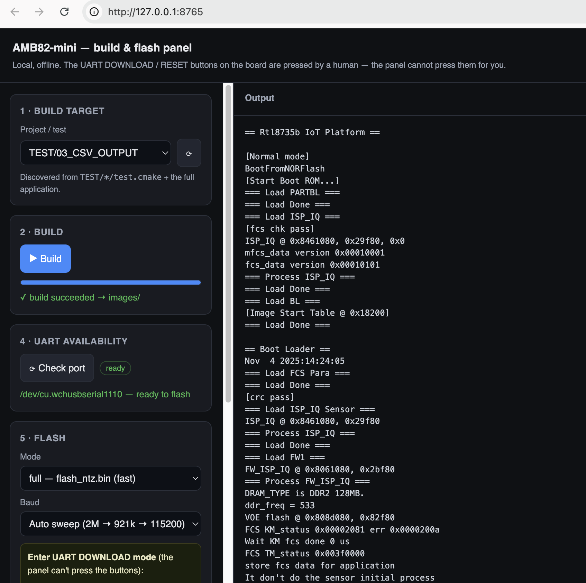

# ameba-flash-ui

A tiny **offline, dependency-free** web panel to **build, flash and serial-monitor**
firmware for the **Realtek AmebaPro2 (RTL8735B / AMB82-mini)** FreeRTOS SDK — all from
one local page. Python 3 standard library only, no `pip install`, no internet: everything
runs on `127.0.0.1`.



It wraps the toolchain you already use (`build_freertos.sh` / `build_test.sh`, the
`uartfwburn` flasher, and the serial port) behind a few buttons:

1. **Pick a build target** — full app or any incremental `TEST/<id>` (auto-discovered).
2. **Build** — runs the build script; shows a progress bar and the result.
3. **Check UART** — finds the USB-serial port and tells you if it is free.
4. **Flash** — calls `uartfwburn` (single clean attempt at a chosen baud; default 115200,
   since the multi-baud sweep can wedge the AmebaPro2 ROM).
5. **Serial log** — streams the board's UART output to the page and to a file, with optional
   per-line timestamps and rotating per-session logs.


> **Scope / honesty:** this is currently tailored to the **AmebaPro2 / AMB82-mini**
> FreeRTOS build on **macOS** (it expects `build_freertos.sh`, `images/flash_ntz.bin`,
> the Realtek `uartfwburn` binary, and a `/dev/cu.wchusbserial*` port). It is small and
> readable on purpose — adapting it to another board/host is mostly editing the paths and
> the flash command at the top of `serve.py`.

## Quick start

```bash
# from your AmebaPro2 project root (the dir with build_freertos.sh and images/)
python3 /path/to/ameba-flash-ui/serve.py
# or point it explicitly:
PROJECT_ROOT=/path/to/your/project python3 serve.py

# then open the URL (NOT the file):
#   http://127.0.0.1:8765
```

Change the port with `FLASH_UI_PORT=9000`. Stop the server with **Ctrl-C**
(Control, not Cmd); from another terminal: `pkill -f serve.py`.

Open it as `http://127.0.0.1:8765`, **not** by double-clicking `index.html` — the page
needs the server for its API (it will tell you so if opened as a file).

## How it works

- `serve.py` — a `ThreadingHTTPServer` (stdlib) that serves `index.html` and exposes a few
  endpoints, streaming live output to the browser via **Server-Sent Events**:
  - `GET /api/targets` — list build targets (`full` + `TEST/*/test.cmake`)
  - `GET /api/build?target=…` — run the build; stream **progress %** and errors only
  - `GET /api/uart` — is the serial port present and free?
  - `GET /api/flash?mode=full|app` — flash via `uartfwburn`, baud sweep
  - `GET /api/serial?autolog=0|1` / `POST /api/serial/stop` — read the port, write a log
  - `POST /api/save-log` — save the current output panel to `LOG/log_<timestamp>.txt`
- `index.html` — a single static page, no framework.

The output panel is capped at the last 2000 lines (so the tab never bloats). **⧉ copy**
puts that visible text on the clipboard; **⤓ save** writes it to a `LOG/` subfolder in the
project root (where the build runs), with a timestamped filename. Both are bounded by the
cap, so size is never an issue.

**Auto-log session** (a checkbox in the serial step): when on, the *full* serial stream of
that session is written to `LOG/session<NN>_<date>_part<NN>.log` — a per-session counter,
the start timestamp, and a part number that rolls over every 10 MB so long runs stay in
manageable files. When off, the stream is logged to a single `logs/serial_<date>.log`.

The **full build log is intentionally not streamed** to the browser: a full SDK build
prints tens of thousands of lines and would crash the tab. The build step shows only
progress + the final status (error lines and the failure tail still come through). The
output panel is meant for the **serial** stream.

## What it deliberately does NOT do

- **It cannot press the board's buttons.** The AMB82-mini does not enter/leave UART
  DOWNLOAD mode over USB by itself. Before flashing, put it into download mode manually
  (hold **UART DOWNLOAD**, tap **RESET**, release); after a successful flash, press
  **RESET** to run the new firmware. The panel prompts you and waits.
- **It does not share the port between the log and the flasher.** Stop the serial log
  before flashing — there is only one port.

## Docs

- [`docs/build_pipeline.md`](docs/build_pipeline.md) — how the AmebaPro2 FreeRTOS build is
  wired (CMake scenario → `TEST_CMAKE` / app sources), and how to add an incremental test.
- [`docs/agent_file_hygiene.md`](docs/agent_file_hygiene.md) — file/environment hygiene
  rules (useful when a coding agent drives the build).

## Requirements

- macOS with Python 3 (stdlib only).
- The Realtek AmebaPro2 SDK project layout: `build_freertos.sh`, `build_test.sh`,
  `images/`, and `uartfwburn` under `sdk/tools/`.
- A USB-serial bridge exposed as `/dev/cu.wchusbserial*`.

## License

MIT © SmartShelfAI — see [LICENSE](LICENSE).
